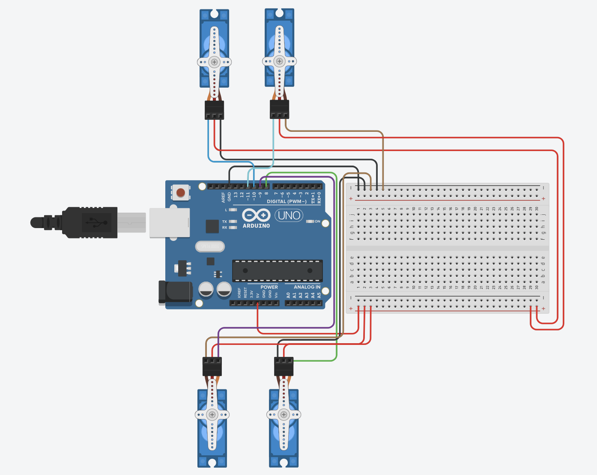

# Servo Motors Simulation

## Project Description
This project demonstrates the control of four servo motors using an Arduino Uno. The servo motors perform a sweep motion for 2 seconds and then stop at a 90-degree position.

The simulation was created and tested using **Tinkercad Circuits**.

## Components Used
- Arduino Uno
- 4 Servo Motors
- Breadboard
- Jumper Wires

## Circuit Design

## Tinkercad Project

You can view the Tinkercad simulation here:

https://www.tinkercad.com/things/5qXTriQ67G6/editel?returnTo=%2Fdashboard%2Fdesigns%2Fall&sharecode=kRjLfK0jfvDfGmmoAPYJr-R8jFG60ey-TPYht2jFQHs

## Simulation Video
YouTube: (https://youtu.be/tGMn4DNo2Ms)

# Prepared by :
Hassan wanqarah
